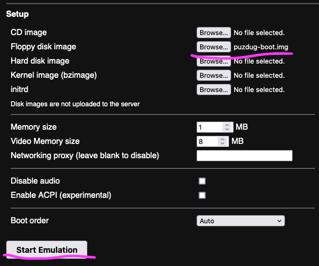

# puzdug x86: a bootable puzzle roguelite

puzdug x86 is a tiny game written in 16-bit real-mode x86 assembly.

It is written such that it can be booted from a floppy on a BIOS-based computer.
Although it does not fit entirely in the boot sector, it comes with a bootloader that will load the game from a known location on disk and boot into that.

## Downloads

Tagged commits are accompanied with a Github [Release](https://github.com/metavee/boot-puzzle-dungeon/releases) with the DOS-compatible `puzdug.com` and the bootable floppy image `puzdug-boot.img` attached.

## Play in the browser

puzdug can be run in the browser using [v86](https://copy.sh/v86/).

Download the bootable floppy image from [Releases](https://github.com/metavee/boot-puzzle-dungeon/releases), and then upload it as the floppy disk image and hit "Start Emulation".

## Developer Setup

Install the following tools:

- [nasm](https://www.nasm.us/)
- [just](https://just.systems/)

Either or both of:

- [qemu](https://www.qemu.org/) (for emulated boot environment)
- [DOSBox](https://www.dosbox.com/) (for more convenient dev workflow)

And optionally:

- [blinkenlights](https://justine.lol/blinkenlights/) (for debugging)

## Running in DOSBox

Build with `just build-dos` or download the pre-built binary from the [Releases](https://github.com/metavee/boot-puzzle-dungeon/releases) page.

Open up DOSBox, mount the repo folder in (you may wish to set up a startup script), and run `PUZDUG.COM` or just `PUZDUG`.

## Running in qemu or a virtual machine

Build and run with `just qemu`. This creates the floppy image `puzdug-boot.bin`. You can also download the pre-built image from the [Releases](https://github.com/metavee/boot-puzzle-dungeon/releases) page.

Note that when the game exits, it enters an infinite loop and you need to kill qemu to fully stop it.

## Debugging

Build and run with `just blinken`. It's recommended to use a big terminal window.
